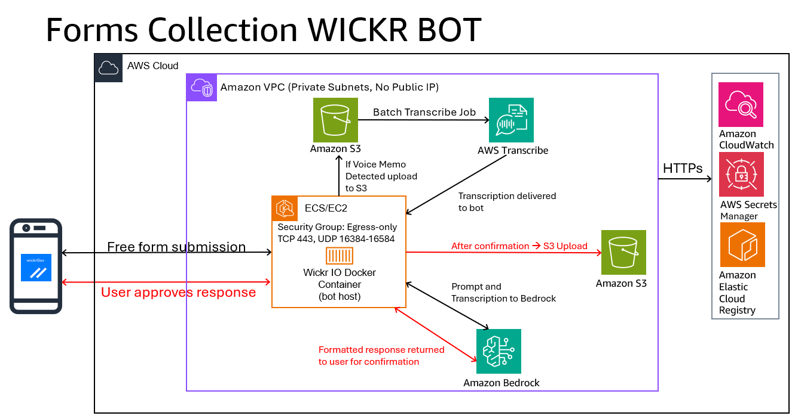

# Form Collection Bot for AWS Wickr

An AWS Wickr IO bot that collects structured military reports from free-form text or voice memos using Amazon Bedrock. Users describe a situation in natural language, the bot classifies the report type, extracts structured fields, and delivers the confirmed report to a Wickr room, Amazon S3, and/or a webhook endpoint.

Includes 7 built-in report types: SALUTE, 9-Line MEDEVAC, 9-Line CAS, PERSTAT, Incident Report, Flight Movement, and Ground Movement. New report types can be added by dropping a single JavaScript file into `bot/forms/` -- no code changes required.

## Features

- Auto-detection of report type from free-form text using Amazon Bedrock
- Field extraction into structured military report formats
- Voice memo transcription via Amazon Transcribe
- Correction loop: review extracted fields, send corrections, re-confirm
- Multi-channel delivery: Wickr room broadcast and S3 JSON storage
- JSON-defined forms: add new report types without code changes

## Architecture



```
User (Wickr Client)
  |
  | Wickr E2E Encrypted
  v
WickrIOSvr (wickrio_bot daemon)
  |
  | ZeroMQ IPC
  v
node bot.js
  |-- form-detector.js -----> Amazon Bedrock (classification)
  |-- extraction-engine.js -> Amazon Bedrock (field extraction)
  |-- transcription-service.js -> Amazon Transcribe (voice memos)
  |-- delivery-service.js ---> Wickr Room + Amazon S3 + Webhook
  |-- form-registry.js -----> JSON form definitions (bot/forms/)
```

## Prerequisites

Before deploying the bot, complete these setup steps:

| Item | Link |
|------|------|
| AWS Wickr network with a bot account (username and password). Adding the bot to your network also covers creating the bot account. | [Setting up AWS Wickr](https://docs.aws.amazon.com/wickr/latest/adminguide/getting-started.html) |
| Make the bot a **room moderator** in every room where it should receive messages. Without moderator status, Wickr does not deliver room text messages to bots. | [Wickr rooms and moderators](https://docs.aws.amazon.com/wickr/latest/userguide/rooms.html) |
| AWS account with Amazon Bedrock model access enabled. The bot uses Claude Sonnet by default on commercial and Meta Llama on GovCloud DoD environments. | [Manage Amazon Bedrock model access](https://docs.aws.amazon.com/bedrock/latest/userguide/model-access.html) |
| AWS CLI v2 installed and configured with credentials that can manage Wickr, Bedrock, S3, Transcribe, and (for Path B) ECS/CDK resources. | [Install the AWS CLI](https://docs.aws.amazon.com/cli/latest/userguide/getting-started-install.html) |
| Node.js 20 or later. Required for `npm ci` and `npx cdk` on your build host. The Wickr IO container itself ships Node.js 20 via NVM; you don't install Node inside the container. | [Install Node.js](https://nodejs.org/) |
| **Path A only:** Docker CE on a supported host (Ubuntu 22.04 or Amazon Linux 2023). Required to run the Wickr IO container on EC2. | [Install Docker Engine](https://docs.docker.com/engine/install/) |
| **Path B only:** AWS CDK v2, bootstrapped in the target account and region. Required to deploy the ECS Fargate stack. | [Getting started with AWS CDK](https://docs.aws.amazon.com/cdk/v2/guide/getting-started.html) |

> **Note:** Building the software tarball on Windows breaks executable permissions on shell scripts inside the tarball, and the Wickr IO import fails with `install shell file is not executable!`. Build the tarball on Linux, macOS, or WSL. See [Step 1](#step-1-build-the-software-tarball) below.

## Deployment

Two deployment paths are available:

| Path | Best For | Infrastructure |
|------|----------|---------------|
| **Path A: EC2 Docker** | Quick setup, testing, single-host | You provide the EC2 + Docker host |
| **Path B: ECS Fargate (CDK)** | Production, automated, scalable | CDK deploys VPC, ECS, S3, IAM |

---

## Path A: EC2 Docker (Interactive Console)

Deploy the bot into an existing Wickr IO container running on an EC2 instance with Docker.

### Path A requirements

In addition to the top-level [Prerequisites](#prerequisites), Path A needs:

- A running Wickr IO container: `public.ecr.aws/x3s2s6k3/wickrio/bot-cloud:latest` (commercial) or `public.ecr.aws/x3s2s6k3/wickrio/bot-cloud-govcloud:latest` (GovCloud)
- IAM credentials on the host (instance profile or `~/.aws/credentials`) with at least the following permissions:

```json
{
  "Version": "2012-10-17",
  "Statement": [
    {
      "Effect": "Allow",
      "Action": ["bedrock:InvokeModel"],
      "Resource": [
        "arn:aws:bedrock:*::foundation-model/*",
        "arn:aws:bedrock:*:*:inference-profile/*"
      ]
    },
    {
      "Effect": "Allow",
      "Action": ["s3:PutObject", "s3:GetObject"],
      "Resource": "arn:aws:s3:::<your-reports-bucket>/*"
    },
    {
      "Effect": "Allow",
      "Action": [
        "transcribe:StartTranscriptionJob",
        "transcribe:GetTranscriptionJob",
        "transcribe:StartStreamTranscription"
      ],
      "Resource": "*"
    }
  ]
}
```

### Step 1: Build the software tarball

Clone this repository and build the tarball from the `bot/` directory. Shell scripts must have executable permissions.

**Linux / macOS:**
```bash
cd bot/
chmod 755 *.sh
tar -czf /tmp/software.tar.gz --owner=0 --group=0 .
```

**Windows (use WSL):**
```bash
wsl -e bash -c 'cd /mnt/c/path/to/bot && chmod 755 *.sh && tar -czf /tmp/software.tar.gz --owner=0 --group=0 .'
```

Verify the tarball structure (files at root level, not nested):
```bash
tar -tzf /tmp/software.tar.gz | head -10
# Expected: ./bot.js, ./package.json, ./install.sh, ./start.sh, ./services/*, etc.
```

### Step 2: Start the Wickr IO container (first time only)

If you do not already have a Wickr IO container running:

```bash
sudo mkdir -p /opt/WickrIO
sudo cp /tmp/software.tar.gz /opt/WickrIO/

docker run \
  -v /home/ubuntu/.aws:/home/wickriouser/.aws \
  -v /opt/WickrIO:/opt/WickrIO \
  --restart=always \
  --name="wickr-form-collection-bot" \
  -ti public.ecr.aws/x3s2s6k3/wickrio/bot-cloud:latest
```

The `-v /home/ubuntu/.aws:/home/wickriouser/.aws` mount provides AWS credentials to the bot for Bedrock, S3, and Transcribe API calls. Ensure the host has IAM credentials configured (via instance profile or `~/.aws/credentials`).

For GovCloud, use the GovCloud base image:
```
public.ecr.aws/x3s2s6k3/wickrio/bot-cloud-govcloud:latest
```

### Step 3: Add a client and import the integration

You are now at the Wickr IO console inside the container.

1. Type `add` to create a new client. Enter the bot username and password when prompted.
2. Type `import` to import the integration.
   - Integration name: `wickr-form-collection-bot`
   - Path to tarball: `/opt/WickrIO` (or wherever you copied it)
3. The console runs `install.sh` (installs npm dependencies) and then `configure.js`.

### Step 4: Configure the bot

During import, the bot prompts for configuration values:

| Prompt | Description | Example |
|--------|-------------|---------|
| AWS Region | Region for Bedrock, S3, and Transcribe | `us-east-1` or `us-gov-west-1` |
| Bedrock Model ID | Model for report classification and extraction | `us.anthropic.claude-sonnet-4-20250514-v1:0` |
| Reports Bucket Name | S3 bucket for confirmed reports (optional) | `my-reports-bucket` |
| Transcription S3 Bucket | S3 bucket for Transcribe staging (optional) | `my-transcribe-bucket` |
| Transcribe Mode | `batch` (default) or `streaming` | `batch` |
| Log Level | `DEBUG`, `INFO`, `WARN`, or `ERROR` | `INFO` |

Leave optional fields empty to disable those features.

**Bedrock Model IDs by environment:**
- Commercial: `us.anthropic.claude-sonnet-4-20250514-v1:0`
- GovCloud (Anthropic): `us-gov.anthropic.claude-3-5-sonnet-20241022-v2:0`
- GovCloud (Meta Llama): `meta.llama3-70b-instruct-v1:0`

> **Note:** Department of Defense (DoD) GovCloud deployments that restrict Anthropic model usage should set `BEDROCK_MODEL_ID` to a Meta Llama model. The bot automatically detects the provider from the model ID and switches prompt format and response parsing accordingly -- no code changes required.

### Step 5: Start the bot

After configuration completes, the bot starts automatically via `start.sh`. Verify:

```bash
# In a second terminal (do not detach from the console with Ctrl+Z)
sudo docker exec wickr-form-collection-bot ps aux | grep node
```

If no node process is running after 30 seconds, start manually:
```bash
sudo docker exec -d wickr-form-collection-bot bash -c \
  'source /usr/local/nvm/nvm.sh && cd /opt/WickrIO/clients/<bot-username>/integration/wickr-form-collection-bot && node bot.js'
```

### Step 6: Test

Send a message to the bot in Wickr:
```
Observed 4 dismounted personnel moving north along the ridgeline at grid AB 1234 5678.
Unknown unit, small arms and 1 RPG. Time of observation 0630Z.
```

The bot should classify this as a SALUTE report, extract the fields, and present a confirmation card. Type `YES` to confirm delivery.

### Updating an existing EC2 deployment

1. Build a new tarball (Step 1)
2. Copy into the container: `sudo docker cp /tmp/software.tar.gz wickr-form-collection-bot:/opt/WickrIO/software.tar.gz`
3. Attach to the console: `sudo docker attach wickr-form-collection-bot`
4. Type `stop` to stop the running client
5. Type `import` and use the same integration name to overwrite
6. Verify the bot starts (Step 5)

**Console tips:**
- Detach without stopping: `Ctrl+P, Ctrl+Q`
- Never use `Ctrl+Z` (stops the container) or `Ctrl+C` (kills WickrIOSvr)

---

## Path B: ECS Fargate (CDK)

Deploy the complete infrastructure using AWS CDK. This creates a VPC, ECS Fargate cluster, S3 reports bucket, IAM roles, and the bot container -- all from a single `cdk deploy`.

### Path B requirements

In addition to the top-level [Prerequisites](#prerequisites), Path B needs:

- Docker running locally -- CDK uses it to build the container image before pushing to Amazon ECR
- AWS credentials with permissions to create VPC, ECS, IAM, S3, ECR, and CloudFormation resources in the target account and region
- A Wickr bot account username and password stored in AWS Secrets Manager (see [Step 1](#step-1-store-bot-credentials-in-secrets-manager) below)

### Step 1: Store bot credentials in Secrets Manager

Create a secret with the bot username and password:

```bash
aws secretsmanager create-secret \
  --name wickr-bot-credentials \
  --secret-string '{"username":"<bot-username>","password":"<bot-password>"}'
```

Note the ARN from the output. You will need it for `config.yaml`.

### Step 2: Configure the deployment

```bash
cd form-collection-bot-deliverable-apg
cp config.example.yaml config.yaml
```

Edit `config.yaml`:

```yaml
account: "123456789012"        # Your AWS account ID
region: "us-east-1"            # Deployment region
credentialsArn: "arn:aws:secretsmanager:us-east-1:123456789012:secret:wickr-bot-credentials-AbCdEf"
isDevelopmentEnv: true         # Enables ECS Exec for debugging
# vpcId: "vpc-0123..."        # Optional: use existing VPC
```

### Step 3: Install dependencies

```bash
npm ci
```

### Step 4: Bootstrap CDK (first time only)

```bash
npx cdk bootstrap aws://<account-id>/<region>
```

### Step 5: Deploy

```bash
npx cdk deploy --require-approval never
```

The deployment takes 5-10 minutes. CDK builds the Docker image, pushes it to Amazon ECR, and creates all infrastructure.

### Step 6: Verify

Check the ECS service in the AWS Console or CLI:

```bash
aws ecs describe-services \
  --cluster FormCollectionBotStack-EcsCluster* \
  --services FormCollectionBotStack-WickrBotService* \
  --query "services[0].{status: status, desired: desiredCount, running: runningCount}"
```

The bot container takes 2-3 minutes to start after deployment (WickrIOSvr authentication + integration setup). Check CloudWatch Logs for startup progress.

### Step 7: Test

Send a message to the bot in Wickr (same as Path A, Step 6).

### Updating an ECS deployment

Modify the bot code, then redeploy:

```bash
npx cdk deploy --require-approval never
```

CDK detects the changed Docker image and triggers a rolling ECS deployment.

### Cleanup

```bash
npx cdk destroy
```

This removes all resources created by the stack (VPC, ECS, S3 bucket, IAM roles).

---

## Built-in Report Types

### SALUTE Report (`/salute`)

Enemy observation report used to report hostile activity. Six fields covering Size, Activity, Location, Unit, Time, and Equipment.

**Example input:**
> Observed 4 dismounted personnel moving north along the ridgeline at grid AB 1234 5678. Unknown unit, small arms and 1 RPG. Time of observation 0630Z.

**Extracted JSON:**
```json
{
  "size": "4 dismounted personnel",
  "activity": "moving north along the ridgeline",
  "location": "AB 1234 5678",
  "unit": "unknown unit",
  "time": "0630Z",
  "equipment": "small arms and 1 RPG"
}
```

### 9-Line MEDEVAC Request (`/9line`)

Standard medical evacuation request format. Nine fields covering Location, Callsign, Precedence, Equipment, Patient Type, Security, Marking, Nationality, and NBC contamination. Precedence, Equipment, Security, Nationality, and NBC are enum fields with restricted values.

**Example input:**
> MEDEVAC request: grid AB 1234 5678, callsign DUSTOFF 7-2 on freq 33.45. 2 litter urgent surgical. No enemy troops in area. Pickup marked with green smoke. US military, no NBC.

**Extracted JSON:**
```json
{
  "location": "AB 1234 5678",
  "callsign": "DUSTOFF 7-2, freq 33.45",
  "precedence": "URGENT SURGICAL",
  "equipment": "NONE",
  "patientType": "2 LITTER",
  "security": "NO ENEMY TROOPS",
  "marking": "SMOKE GREEN",
  "nationality": "US MILITARY",
  "nbc": "NONE"
}
```

### 9-Line CAS Brief (`/cas`)

Close Air Support request used by JTACs. Fifteen fields covering JTAC callsign, control type, IP/BP, heading, distance, target elevation, target description, target location, type mark, friendlies, egress, and optional remarks/TOT/TTT.

**Example input:**
> CAS request: JTAC is REAPER 11, type 1 control. IP north, heading 180. Target is enemy fighting position at grid AB 1234 5678, elevation 450m. Mark with laser code 1688. Friendlies 300m south. Egress west.

**Extracted JSON:**
```json
{
  "jtac": "REAPER 11",
  "controlType": "Type 1",
  "ipBp": "IP north",
  "heading": "180",
  "targetDescription": "enemy fighting position",
  "targetLocation": "AB 1234 5678",
  "targetElevation": "450m",
  "typeMark": "Laser 1688",
  "friendlies": "300m south",
  "egress": "West"
}
```

### PERSTAT Report (`/perstat`)

Personnel Status (RED 1) report for unit accountability. Nine fields covering Company, Platoon, Location, Assigned, Present for Duty, Leave/Pass, TDY, Replacements, and Remarks.

**Example input:**
> Alpha Company, 1st Platoon at grid 11SNA 4523 6789. 32 assigned, 28 present for duty, 2 on leave, 1 TDY. Need 1 replacement 11B E-4.

**Extracted JSON:**
```json
{
  "company": "Alpha Company",
  "platoon": "1st Platoon",
  "location": "11SNA 4523 6789",
  "assigned": "32",
  "presentForDuty": "28",
  "leavePass": "2",
  "tdy": "1",
  "replacements": "1x 11B E-4",
  "remarks": null
}
```

### Incident Report (`/incident`)

Workplace or field incident report. Five fields covering Date/Time, Location, Severity (enum: LOW, MEDIUM, HIGH, CRITICAL), Description, and Affected Persons. Severity is a required enum field -- the bot will block delivery if it cannot be determined.

**Example input:**
> Chemical spill in Building A loading dock at 2pm today. Severity high. 3 employees affected, one with skin irritation.

**Extracted JSON:**
```json
{
  "dateTime": "2pm today",
  "location": "Building A loading dock",
  "severity": "HIGH",
  "description": "Chemical spill",
  "affectedPersons": "3 employees, one with skin irritation"
}
```

### Flight Movement Report (`/flight`)

Air travel and redeployment tracking. Ten fields covering POC, Movement type, DTG, Departure, Destination, Air (flight details), PAX, Unit, Names, and optional Next Flight.

**Example input:**
> Flight Movement Report: POC SFC Johnson, Redeployment, DTG 172325OCT25, departing MNL to HND, flight JL078 ETA 0440 on 18 Oct, 2 PAX, unit 1163d TFSB, names SFC J & SGT C. Next flight 1745 HND-SEA / JL068 / 1025 arrival.

**Extracted JSON:**
```json
{
  "poc": "SFC Johnson",
  "movement": "Redeployment",
  "dtg": "172325OCT25",
  "departure": "MNL",
  "destination": "HND",
  "air": "JL078 ETA 0440 on 18 Oct",
  "pax": "2",
  "unit": "1163d TFSB",
  "names": "SFC J & SGT C",
  "nextFlight": "1745 HND-SEA / JL068 / 1025 arrival"
}
```

### Ground Movement Report (`/ground`)

Vehicle convoy and ground transportation tracking. Nine fields covering POC (with optional phone), Movement type, DTG, Departure, Destination, Vehicle (type and count), PAX, Unit, and optional Notes (personnel manifest).

**Example input:**
> Ground Movement Report: POC SFC N +86-010-1234-5678, SP, DTG 200825May2025, departing Marriott/Westin to Camp A, VAN x 1, 4 PAX, unit 1MDTF. Manifest: MAJ Brian, SSG Jones, SSG Kim, SGT David.

**Extracted JSON:**
```json
{
  "poc": "SFC N +86-010-1234-5678",
  "movement": "SP",
  "dtg": "200825May2025",
  "departure": "Marriott/Westin",
  "destination": "Camp A",
  "vehicle": "VAN x 1",
  "pax": "4",
  "unit": "1MDTF",
  "notes": "MAJ Brian, SSG Jones, SSG Kim, SGT David"
}
```

---

## Adding New Report Types

Report types are defined as JavaScript modules in `bot/forms/`. The bot auto-loads all files in this directory at startup. No changes to `bot.js`, the message router, or any other file are needed.

### Form Definition Schema

Create a new file in `bot/forms/` (e.g., `sitrep.js`). Export a single object:

```javascript
'use strict';

module.exports = {
  // --- Identity ---
  id: 'SITREP',                    // Unique ID (uppercase). Used as the Map key and Bedrock classification target.
  name: 'Situation Report',        // Human-readable name shown in cards and messages.
  command: '/sitrep',              // Slash command prefix. Enables /sitrep help, /sitrep set-room, etc.

  // --- Detection ---
  detectionHint: 'A situation report for unit status updates. Keywords: sitrep, situation, ' +
    'status update, operational summary, current operations.',
  // Used by form-detector.js to build the Bedrock classification prompt.
  // Include the report type name and 5-10 keywords that a user might say.

  // --- Fields ---
  fields: [
    { key: 'dtg',        label: 'DTG',              type: 'text' },
    { key: 'unit',       label: 'Unit',             type: 'text' },
    { key: 'location',   label: 'Location',         type: 'text' },
    { key: 'activity',   label: 'Current Activity', type: 'text' },
    { key: 'status',     label: 'Status',           type: 'enum',
      validValues: ['GREEN', 'AMBER', 'RED', 'BLACK'] },
    { key: 'remarks',    label: 'Remarks',          type: 'text', optional: true },
  ],
  // key:    JSON key in the extracted report object. Must be unique within this form.
  // label:  Display label shown in the confirmation card.
  // type:   'text' (free-form) or 'enum' (restricted values).
  //         Enum fields include validValues array; extraction normalizes to these.
  // optional: true means the field is not required. Null values show as "[Not provided]".

  // --- Extraction Prompt ---
  extractionPrompt: `You are a military report extraction specialist. Extract SITREP fields from the text.

Return ONLY a valid JSON object with these keys:
- dtg: Date-time group (e.g., "081400ZAPR2026"). Free text.
- unit: Unit designation (e.g., "Alpha Company, 2-501 IN"). Free text.
- location: Grid coordinates or description. Free text.
- activity: What the unit is currently doing. Free text.
- status: Must be exactly one of: GREEN, AMBER, RED, BLACK
- remarks: Additional notes. Free text or null.

Rules:
1. If a field cannot be determined, set it to null.
2. For enum fields, use ONLY the exact values listed. If unclear, set to null.
3. Return ONLY raw JSON. No markdown, no explanation.`,

  // --- Correction Prompt ---
  correctionPrompt: `You are a report correction specialist. You receive:
1. CURRENT FIELDS: JSON object with current report fields.
2. CORRECTION: User's free-form correction text.

Return ONLY a JSON object with the corrected fields. Do NOT include unchanged fields.

Fields: dtg, unit, location, activity, status (GREEN/AMBER/RED/BLACK), remarks.

Rules:
1. Return ONLY corrected fields as JSON.
2. For status, use ONLY: GREEN, AMBER, RED, BLACK.
3. If unclear, return empty object: {}`,

  // --- Display ---
  formatHeader: '=== SITUATION REPORT ===',
  formatFooter: '========================',
  exampleInput: 'Alpha Company at grid AB 1234 5678, conducting route clearance. Status green. DTG 081400ZAPR2026.',

  // --- Delivery Outputs ---
  outputs: [
    { type: 'wickr-room', kvKey: 'SITREP_ROOM_VGROUPID', envVar: 'SITREP_ROOM_VGROUPID' },
    { type: 's3', bucketEnvVar: 'REPORTS_BUCKET', prefix: 'sitrep-reports/' },
    { type: 'webhook', kvKey: 'SITREP_WEBHOOK_URL', envVar: 'SITREP_WEBHOOK_URL' },
  ],
};
```

### Output Types

Each entry in the `outputs` array defines a delivery channel:

| Type | Required Keys | Description |
|------|--------------|-------------|
| `wickr-room` | `kvKey`, `envVar` | Broadcasts the formatted report to a Wickr room. Room ID is stored in the KV store via `/<form> set-room`. |
| `s3` | `bucketEnvVar`, `prefix` | Stores the report as JSON in S3. Bucket name comes from the environment variable named in `bucketEnvVar`. Files are stored under `<prefix><date>/<uuid>.json`. |
| `webhook` | `kvKey`, `envVar` | POSTs the report as JSON to an HTTPS URL. URL is stored in the KV store via `/<form> set-webhook <url>`. |

The `kvKey` is the Wickr IO key-value store key used to persist the configuration. Use a unique key per form per output type (e.g., `SITREP_ROOM_VGROUPID`, `SITREP_WEBHOOK_URL`).

### What You Get Automatically

When you add a form definition file to `bot/forms/`, the following features are wired up with zero additional code:

- Auto-detection from free-form text (via `detectionHint` in the Bedrock classification prompt)
- Field extraction from text using `extractionPrompt`
- Confirmation card display with all fields
- Correction loop using `correctionPrompt`
- Voice memo transcription and extraction
- `/<form> help` -- lists fields, example input, and available admin commands
- `/<form> set-room` -- configures the Wickr room delivery target
- `/<form> set-webhook <url>` -- configures the webhook delivery target
- `/<form> status` -- shows current delivery configuration
- Delivery to all configured output channels on confirmation
- S3 JSON storage with date-partitioned keys
- Webhook POST with structured JSON payload

### Tips for Writing Prompts

- Be explicit about the JSON keys and their types in the extraction prompt
- For enum fields, list the exact valid values and tell the model to use null if unsure
- Always include "Return ONLY a raw JSON object. No markdown, no explanation."
- Include one complete example response in the extraction prompt
- For the correction prompt, list all field names so the model knows what can be corrected
- Test with varied input phrasing -- military reports come in many styles

## Available Commands

| Command | Description |
|---------|-------------|
| `/help` | List all available commands and report types |
| `/set-rooms` | Set this room as broadcast room for all forms |
| `/set-rooms SALUTE CAS` | Set this room for specific forms only |
| `/status` | Show delivery configuration for all forms |
| `/salute <text>` | Submit a SALUTE report directly |
| `/9line <text>` | Submit a 9-Line MEDEVAC request directly |
| `/cas <text>` | Submit a CAS brief directly |
| `/flight <text>` | Submit a Flight Movement Report directly |
| `/ground <text>` | Submit a Ground Movement Report directly |
| `/salute help` | Show SALUTE-specific commands |
| `/salute set-room` | Configure the delivery room for SALUTE reports |
| `/salute set-webhook <url>` | Configure a webhook URL for SALUTE delivery |
| `/salute status` | Show SALUTE delivery configuration |

The same `help`, `set-room`, `set-webhook`, and `status` sub-commands are available for every form type (`/9line`, `/cas`, `/perstat`, `/incident`).

Or simply send free-form text or a voice memo -- the bot auto-detects the report type.

## Delivery Channels

Each confirmed report is delivered to all configured output channels:

| Channel | Configuration | Description |
|---------|--------------|-------------|
| Wickr Room | `/<form> set-room` (run from the target room) | Broadcasts the formatted report to a Wickr room |
| Amazon S3 | `REPORTS_BUCKET_NAME` environment variable | Stores the report as a JSON file in S3 |
| Webhook | `/<form> set-webhook <url>` | POSTs the report as JSON to an HTTPS endpoint |

All three channels are configured per form type. Channels without configuration are skipped (with a failure note in the delivery response). S3 is configured via environment variable; Wickr room and webhook are configured via bot commands and persisted in the Wickr IO key-value store.

## Project Structure

```
form-collection-bot-deliverable-apg/
  bin/app.ts              CDK app entry point
  lib/                    CDK constructs (VPC, ECS, Wickr bot)
  bot/                    Bot source code
    bot.js                Entry point
    services/             Service modules
    forms/                JSON form definitions
    scripts/start-bot.sh  ECS Fargate entrypoint
    test/                 Unit and property-based tests
  config.yaml             Deployment configuration (not committed)
  config.example.yaml     Configuration template
```

## Security

See [CONTRIBUTING](CONTRIBUTING.md) for more information.

## License

This library is licensed under the MIT-0 License. See the [LICENSE](LICENSE) file.
